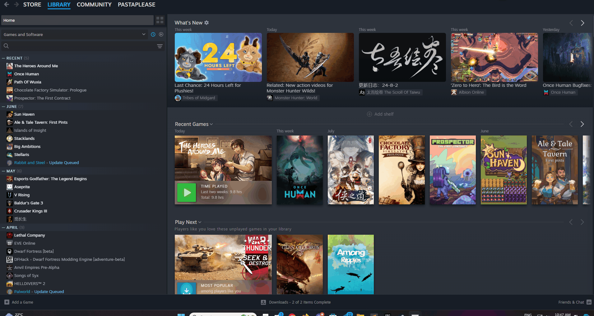
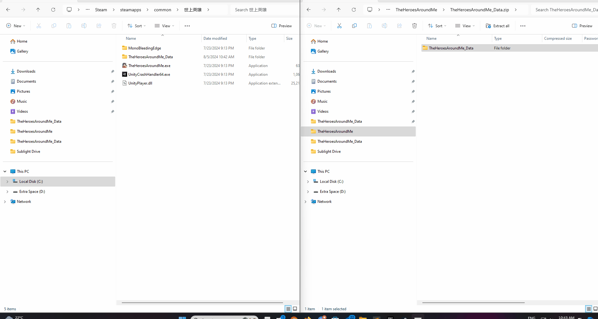

# The Heroes Around Me English Translations

## How to Install
Grab the latest release and extract the content of the TheHeroesAroundMeEnglishMod.zip file into the games folder.

If you installed steam and the game in their default locations the path should be:  
```C:\Program Files (x86)\Steam\steamapps\common\世上英雄```.

Alternatively, you can open the path through steam.



Install the mod by dragging the contents into the game



Now just start the game over Steam and enjoy!  